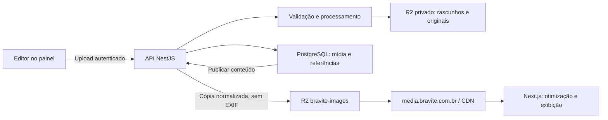

# Plano de conexão das imagens à Cloudflare

Data: 5 de outubro de 2026. Base analisada: commit `5119da7` do BraviteTech.

## Decisão para a Bravite

Usar **Cloudflare R2** para armazenamento das imagens editoriais e entregar as imagens publicadas por **https://media.bravite.com.br**. O bucket **bravite-images**, informado pelo proprietário como já criado, será o armazenamento público de capas e imagens dos artigos e dos cases. O Next.js continua sendo a aplicação; o NestJS controla os uploads e o PostgreSQL guarda as referências e os metadados.

O domínio personalizado do bucket precisa de um hostname dedicado. Não precisa obrigatoriamente ser um subdomínio em todo projeto, mas **nesta aplicação deve ser**, pois `www.bravite.com.br` é o endereço do site. Conectar `www` ao R2 pode substituir o destino do site pela entrega de arquivos. A divisão proposta é:

| Endereço | Função |
| --- | --- |
| `www.bravite.com.br` | Next.js: site, blog, cases e painel; proxy das rotas NestJS |
| `bravite.com.br` | Redirecionamento para a URL canônica do site, a confirmar na implantação |
| `media.bravite.com.br` | Leitura pública das imagens publicadas do bucket `bravite-images` |
| Endpoint S3 do R2 | Operações autenticadas de armazenamento feitas pelo backend |

## O que foi confirmado

| Item | Evidência / situação |
| --- | --- |
| Bucket `bravite-images` | Informado pelo proprietário; conta, localização, conteúdo e configuração não inspecionados |
| DNS do domínio | Consulta pública retornou `gail.ns.cloudflare.com` e `walt.ns.cloudflare.com` |
| `www.bravite.com.br` | Consulta A retornou endereços da rede Cloudflare; não comprova o destino da aplicação no origin |
| `media.bravite.com.br` | Consulta DNS pública retornou NXDOMAIN; subdomínio ainda não resolvia no momento da análise |
| Integração do código | Existe upload para Cloudflare Images; não existe adaptador R2 |
| Acesso nesta sessão | Plugin mencionado não expôs ferramentas autenticadas; não havia credenciais Cloudflare/R2 configuradas no processo ou `.env.local` deste checkout |

O proprietário autorizou adicionar o subdomínio. **A conexão na conta não foi executada**, porque o acesso autenticado não estava disponível nesta sessão. Não foi alterado nenhum registro DNS, bucket ou regra da Cloudflare. Esta entrega registra o planejamento e a especificação para implementação.

## Etapa 1 — Conectar o domínio ao bucket existente

Dependência: ferramentas autenticadas do plugin Cloudflare ou acesso autorizado à conta. O login no navegador, isoladamente, não disponibiliza operações da conta ao agente.

1. Identificar a conta que contém `bravite-images` e confirmar que a zona `bravite.com.br` pertence à mesma conta. Os nameservers públicos não identificam a conta proprietária.
2. Inspecionar o conteúdo do bucket antes de habilitar acesso público. Um domínio personalizado torna acessíveis os objetos daquele bucket; uma pasta chamada `private/` ou um nome aleatório não cria privacidade.
3. No dashboard: **R2 object storage → bravite-images → Settings → Custom Domains → Add**.
4. Informar **media.bravite.com.br**; revisar o registro proposto e conectar. Usar a configuração de domínio personalizado do R2 para gerar o vínculo e o DNS. Não criar CNAME manual apontando para `r2.dev`.
5. Aguardar estado **Active**, emissão do certificado e resolução DNS. Confirmar que os registros e o destino de `www.bravite.com.br` foram preservados.
6. Manter o acesso público por `r2.dev` desligado. O domínio personalizado é a URL de produção; o endpoint S3 continua exigindo autenticação para escrita.
7. Validar HTTPS, leitura de uma imagem editorial autorizada e os cabeçalhos de conteúdo/cache. A raiz do domínio de mídia não precisa listar arquivos.

Se o bucket contiver arquivos privados ou imagens de rascunhos, organizar sua separação antes de habilitar o domínio. Não publicar nem apagar o conteúdo existente automaticamente.

Também conferir se o proprietário chegou a confirmar o vínculo de `www.bravite.com.br` ao bucket ou apenas preencheu o campo. Se ele já estiver vinculado, registrar o DNS atual e confirmar o destino correto do host da aplicação antes de corrigir. Remover um domínio personalizado do R2 pode remover seu registro DNS; nesse caso, restaurar o registro de `www` para o host confirmado do site e verificar a aplicação. A consulta DNS pública, sozinha, não distingue esses destinos por trás do proxy Cloudflare.

## Etapa 2 — Proteger rascunhos e preparar o backend

Criar um segundo bucket, nome proposto **bravite-images-private**, com acesso público e `r2.dev` desativados e sem domínio personalizado. Ele guarda os arquivos enviados, originais e imagens ainda não publicadas. Ambientes de homologação devem ter seus próprios buckets e credenciais.

O fluxo editorial será:

Para os uploads atuais de até 8 MiB, manter o envio **painel → API → R2**. Isso reutiliza autenticação e validação do servidor e mantém as credenciais fora do navegador. Upload direto com URL assinada só deve ser acrescentado quando houver necessidade concreta.

A aplicação não deve passar a escrever arquivos locais em produção quando a configuração do R2 estiver incompleta ou indisponível. Deve mostrar erro recuperável e preservar o conteúdo já salvo.

## Etapa 3 — Integrar o blog e os cases

Implementar upload de capa e imagens no corpo do artigo, biblioteca de mídia, texto alternativo, dimensões e referências por ID. Os artigos e cases compartilham o serviço de mídia. Ao publicar, preparar os objetos públicos antes de tornar o conteúdo visível; ao substituir uma imagem, criar uma nova chave de objeto.

Manter `next/image` como otimizador inicial. O R2 entrega os arquivos públicos e a Cloudflare os guarda em cache; R2 não redimensiona imagens automaticamente. Uma etapa posterior poderá transferir a otimização para Cloudflare Images Transformations, com loader próprio e revisão dos custos.

O documento [Implementações necessárias](CLOUDFLARE-IMPLEMENTACOES.md) detalha os arquivos, contratos, migrações, regras de cache e critérios de aceite.

## Ordem de entrega

| Ordem | Entrega | Resultado esperado |
| --- | --- | --- |
| 1 | Conta, domínio e buckets | `media` entrega mídia pública; rascunhos continuam privados; `www` serve a aplicação |
| 2 | Credenciais e adaptador R2 | Backend envia, lê e remove arquivos com permissões limitadas aos buckets necessários |
| 3 | Metadados e ciclo editorial | Upload e publicação não deixam URLs quebradas ou arquivos sem referência |
| 4 | Painel, capas e imagens inline | Editor gerencia as imagens do blog e dos cases sem URLs externas arbitrárias |
| 5 | Cache, migração e operação | Imagens antigas continuam acessíveis; cache, métricas e recuperação ficam definidos |
| 6 | Melhorias opcionais | Transformações na borda, Turnstile e Access, conforme necessidade e plano da conta |

## Dados necessários para executar

- Conta e zona Cloudflare corretas, localização/jurisdição e configuração atual de `bravite-images`.
- Acesso autenticado às operações de domínio personalizado do R2 e da zona; autorização para `media.bravite.com.br` já fornecida pelo proprietário.
- Access Key ID e Secret Access Key **do R2**, restritas aos buckets da aplicação, cadastradas no gerenciador de Secrets do servidor. Não enviar segredos em chat.
- Endereço do host de produção e origens de homologação, para HTTPS, CORS e configuração do Next.js.
- Inventário dos arquivos existentes e do banco de produção, para decidir a migração real.

Referências oficiais: [domínios personalizados R2](https://developers.cloudflare.com/r2/buckets/public-buckets/), [autenticação R2](https://developers.cloudflare.com/r2/api/tokens/), [CORS R2](https://developers.cloudflare.com/r2/buckets/cors/).
